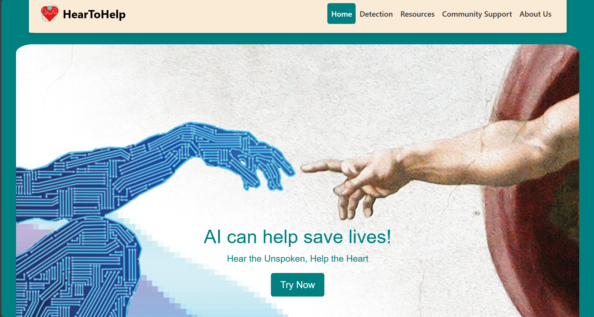
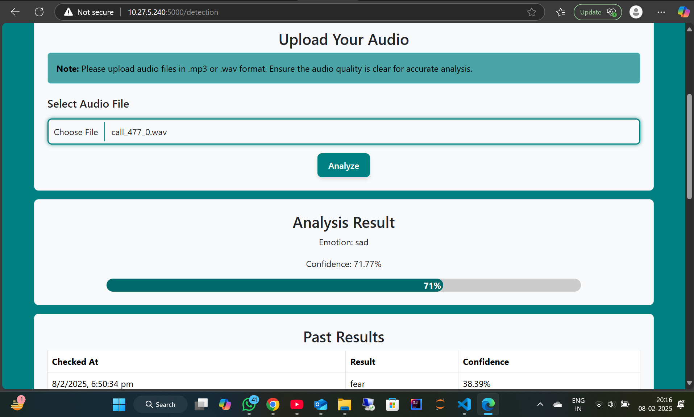
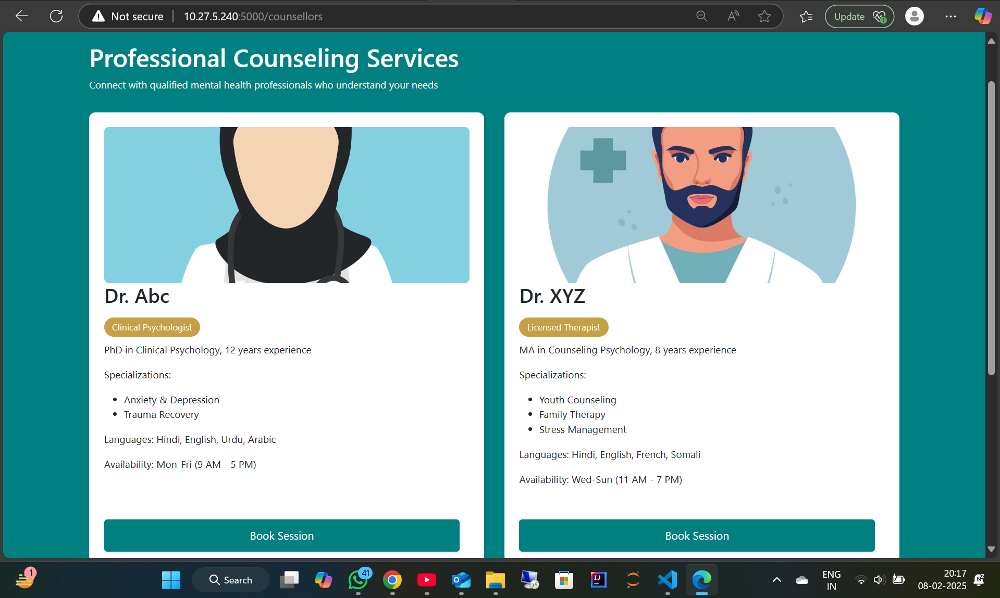
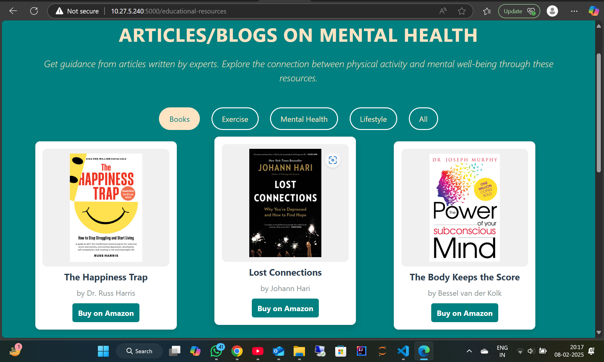
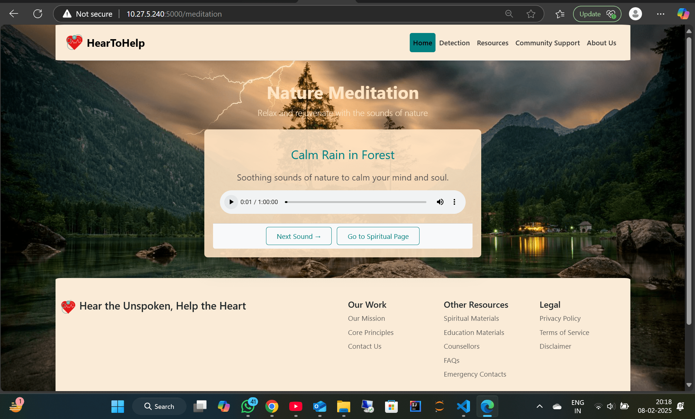

# HearToHelp

### 🌟 Predict Mental State Using Voice Analysis

HearToHelp is an AI-powered web application that analyzes human speech to predict mental states using deep learning techniques. Our project leverages **Machine Learning & Audio Processing** to detect emotions and mental well-being based on voice input. Hear to help is not only limited to this feature but also provides various resources like educational resources, meditational resources, spriritual resources and a counselors.

## 🚀 Features

- 🎙️ **Audio-Based Mental State Prediction**  
- 🧠 **Deep Learning with TensorFlow & Keras**  
- 🎵 **Feature Extraction with Librosa**  
- 🌐 **Web Interface Built with Flask, Bootstrap, Vanilla CSS & JavaScript**  
- 📊 **Predictions & Visualization**  

## 🛠️ Tech Stack

### 🔹 Backend  
- **Flask** - Lightweight Python web framework   
- **Librosa** - Audio processing & feature extraction  

### 🔹 Frontend  
- **Bootstrap** - Styling & UI components  
- **Vanilla CSS** - Custom styles  

### 🔹 Data Analysis And Predictive Modelling
- **Librosa** - Data Preprocessing
- **Numpy and Pandas** - Data Analysis
- **Matplotlib & Seaborn** - Data Visualization
- **TensorFlow & Keras** - Model training & inference 

## 📌 Installation

1️⃣ **Clone the repository**  
```sh
git clone https://github.com/MohammadAdnanKhan/HearToHelp_
cd HearToHelp_
```

2️⃣ **Create a virtual environment (Optional but recommended)**
```sh
python -m venv .venv
source .venv/bin/activate  # On Windows, use: .venv\Scripts\activate
```

3️⃣ **Install dependencies**
```sh
pip install -r requirements.txt
```

4️⃣ **Run the Flask app**
```sh
python app.py
```
The app will be available at: **http://127.0.0.1:5000/**

## 🏗️ How It Works  

1. The user uploads an **audio file** (speech recording).  
2. **Librosa** extracts key audio features (ZCR, RMS, MFCCs).  
3. Our **deep learning model** (LSTM) predicts the speaker’s **emotional state**.  
4. The result is displayed on the **web app** and the results are saved (We don not save the audios because of our privacy policy).  

## 🤖 WebApp Screenshots
**Home Page**


**Detection Page**


**Resources Page**

***Counselors Portal***


***Educational Resources***


***Meditational Resources***


## 📅 Future Plans  
- 🌍 Deploy on cloud (AWS, Heroku, Render, etc.)  
- 📱 Develop a mobile app  
- 🎭 Improve emotion classification accuracy  

## 🤝 Contributing  
We welcome contributions! Feel free to open an **issue** or **pull request**.  

## 📜 License  
This project is **MIT Licensed**, - see the [LICENSE](./LICENSE) file for details.

---

### 🚀 Team HearToHelp  
👨‍💻 **Team Members:**  
- [Mohd Adnan Khan](https://www.linkedin.com/in/mohdadnan-khan)
- [Mohd Shamoon](https://www.linkedin.com/in/mohd-shamoon-9261402b4)
- [Muhammed Ashrah](https://www.linkedin.com/in/muhammed-ashrah)
- [Mohd Reyyan](https://www.linkedin.com/in/mohd-reyaan)